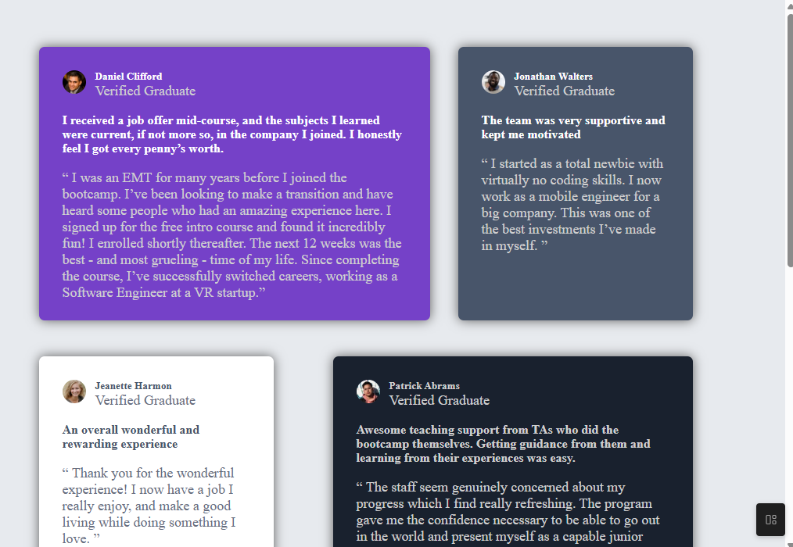

# Frontend Mentor - Testimonials grid section solution

This is a solution to the [Testimonials grid section challenge on Frontend Mentor](https://www.frontendmentor.io/challenges/testimonials-grid-section-Nnw6J7Un7). Frontend Mentor challenges help you improve your coding skills by building realistic projects. 

## Table of contents

- [Overview](#overview)
  - [The challenge](#the-challenge)
  - [Screenshot](#screenshot)
  - [Links](#links)
- [My process](#my-process)
  - [Built with](#built-with)
  - [What I learned](#what-i-learned)
  - [Continued development](#continued-development)
  - [Useful resources](#useful-resources)
- [Author](#author)
- [Acknowledgments](#acknowledgments)

## Overview

So this README contains my process, links to my solution and live server, Built with libraries and tools, what i learnt in this challenge, and my Acknowledgments.

### The challenge

Users should be able to:

- View the optimal layout for the site depending on their device's screen size

### Screenshot

### Links

- Solution URL: [solution URL here](https://your-solution-url.com)
- Live Site URL: [live site URL here](https://your-live-site-url.com)

## My process

I started with the mobile-Approach first, and worked my way into the desktop view, so as to make the layout for mobile phones look very nice.

### Built with

- Semantic HTML5 markup
- CSS custom properties
- Flexbox
- CSS Grid
- SASS
- Smacks
- Mobile-first workflow

### What I learned

Well i learnt how to use grid to make proper layout to the webpage, and i also learnt that css flexbox, doesn't properly arranges the items in a webpage. CSS Grid is more 2D focused, and is what is used for this challenge.

### Continued development

Unfortunately i wasn't able to fully recreate the layout used in this challenge, and i would really like to focuse more on how to properly use grid, and make proper layouts.

### Useful resources

ChatGPT gave me an idea that i have to use grid instead of flexbox, and also explained how to use the grid-template-rows.

## Author

- Youtube - [CodeWithMe](https://www.your-site.com)
- Frontend Mentor - [@Rafman0](https://www.frontendmentor.io/profile/yourusername)
- Twitter - [@Rafman](https://www.twitter.com/yourusername)

## Acknowledgments

Would like to give credit to myself for being able to have come this far, and for even doing the challenges.
